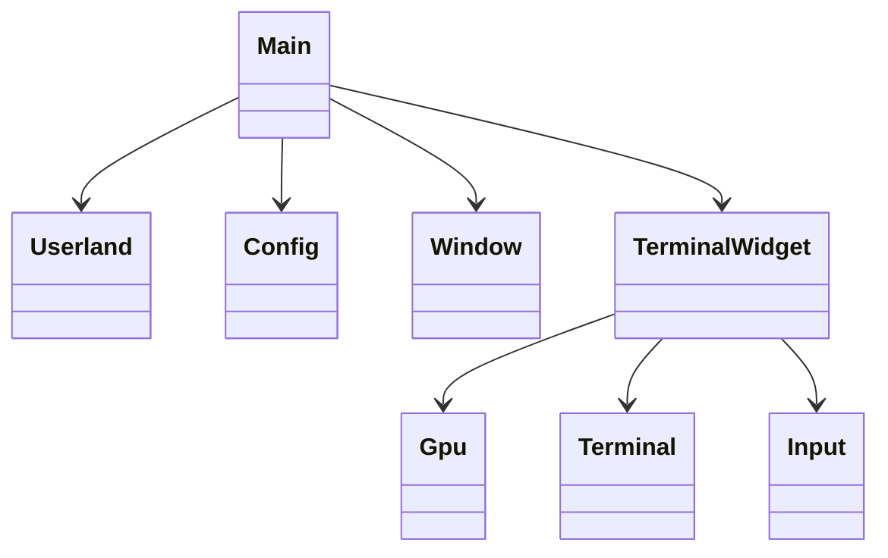
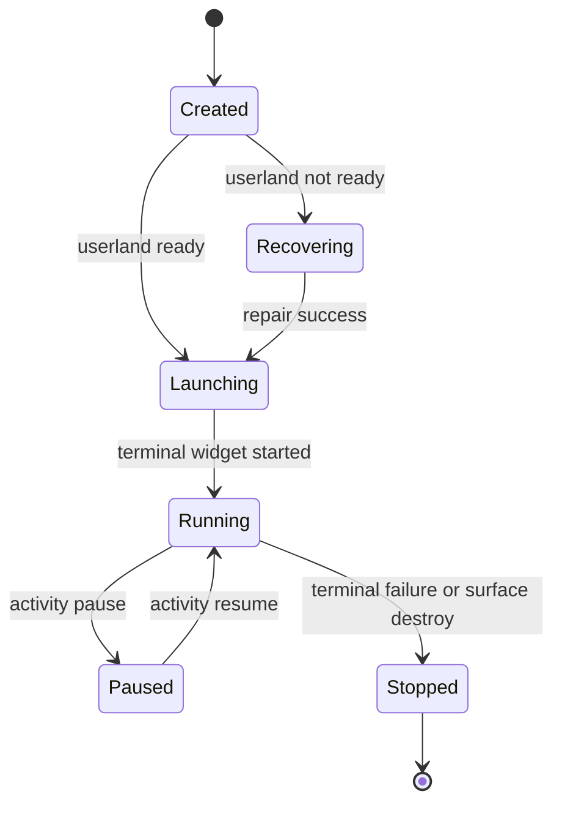
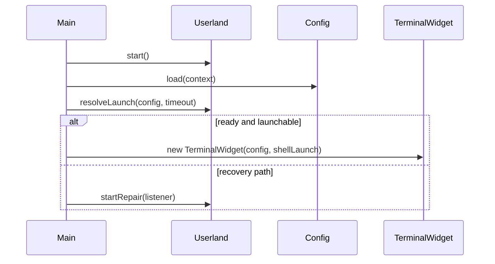
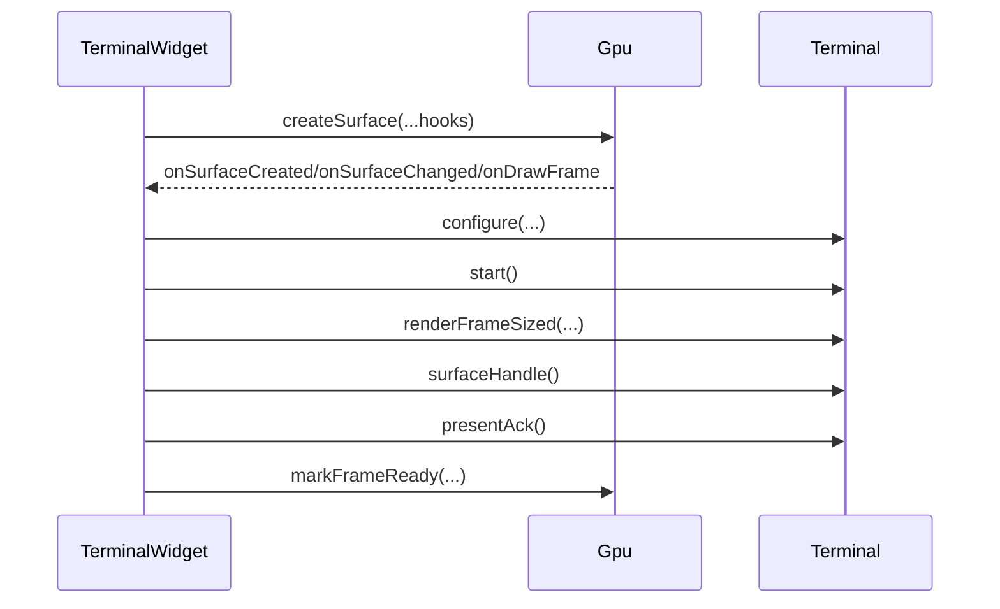

# Design

Shared rules: [`../../design/design-rules.md`](../../design/design-rules.md)

## Purpose
`howl-android-host` owns Android activity, userland readiness, widget composition, input routing, IME/window integration, and GLES presentation.

It should stay a host shell around `howl-term` and the Android runtime environment.

## Public Surface
- `Main`: activity owner.
- `Userland`: userland owner.
- `Config`: persisted config owner.
- `Window`: window/layout owner.
- `Input`: root gesture/input owner.
- `Gpu`: Android GL owner.
- `Terminal`: Java-side JNI terminal owner.
- `TerminalWidget`: terminal widget owner.

## Ownership Rules
- `Main` owns activity lifecycle and top-level composition.
- `Userland` owns readiness, launch resolution, and repair orchestration.
- `TerminalWidget` owns terminal surface/runtime composition, scrollback overlay, input focus routing, and consumption of the exported retained surface handle.
- `Terminal` owns Java-to-native runtime calls.
- `Gpu` owns GL surface creation and presentation.
- `Window` and `Input` own boring host surfaces over their sub-units.

## Lifecycle

## Main Flows
### Launch And Userland Resolution

### Render Flow

## API Contracts
- `Userland.resolveLaunch` returns a host launch contract, not a running session.
- `TerminalWidget.view` builds the runtime view hierarchy and starts GPU/terminal ownership.
- `Terminal.start` requires native runtime readiness and configured shell input.
- `Gpu` owns the GL surface contract and presents the exported terminal surface, but not terminal semantics.
- `Window` and `Input` should stay thin public owners over their units.

## Non-Goals
- PTY/session implementation details.
- VT parsing semantics.
- Shared render contract design.

## Change Rules
- New Android platform detail should land in the relevant unit under `input/`, `window/`, `terminal/`, `widget/`, or `userland/`.
- `Main` should stay orchestration-only.
- Public host callers should depend on boring owners, not deep unit classes.
